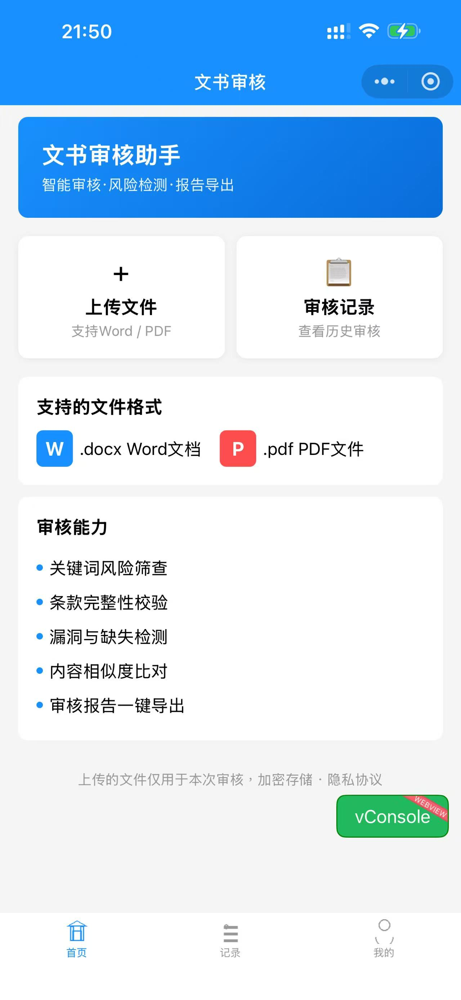
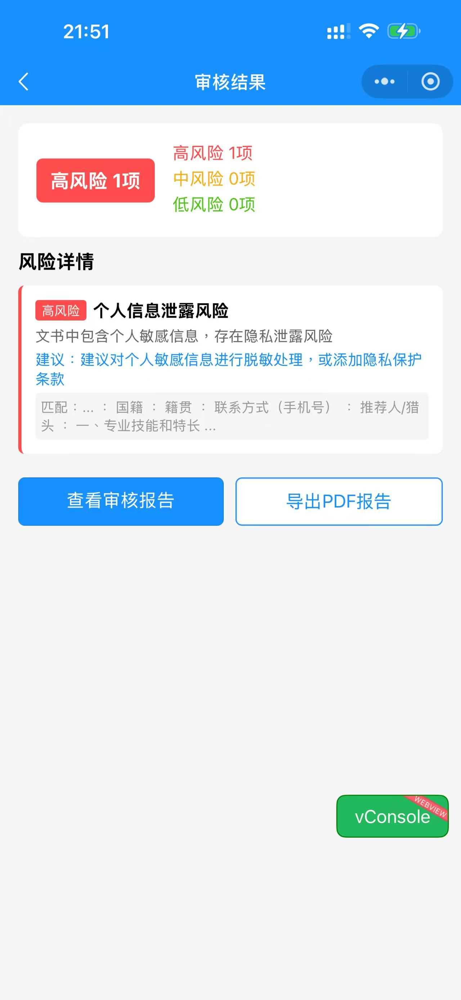
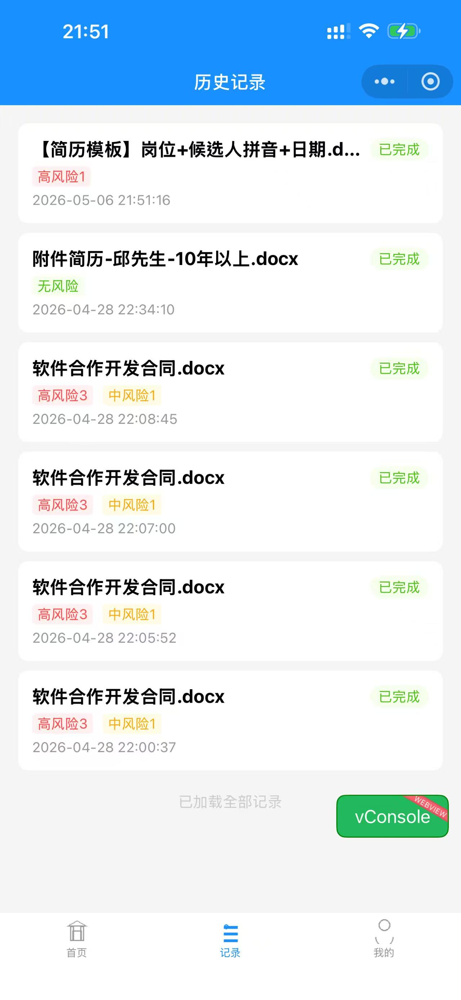
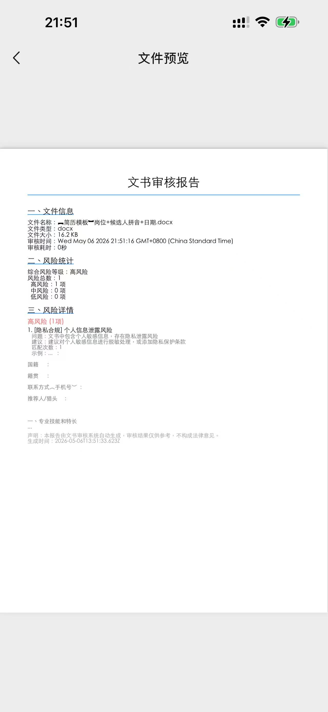
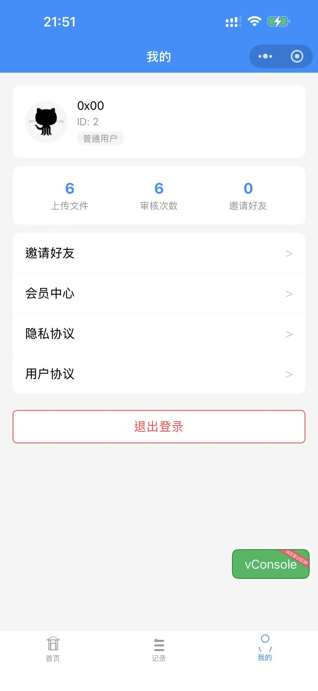
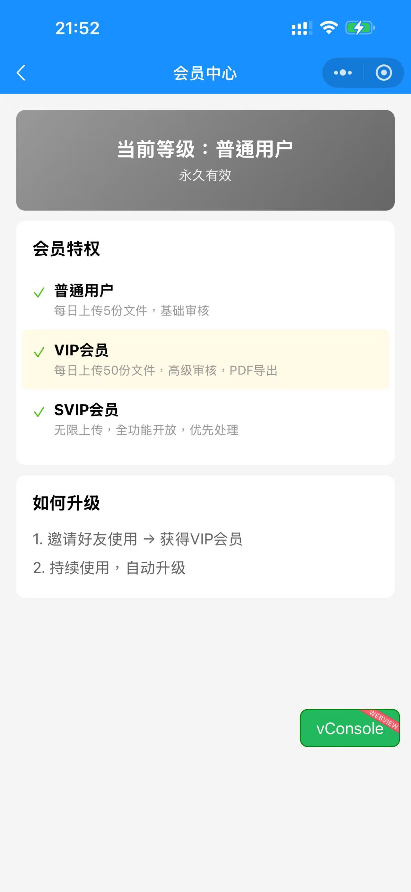
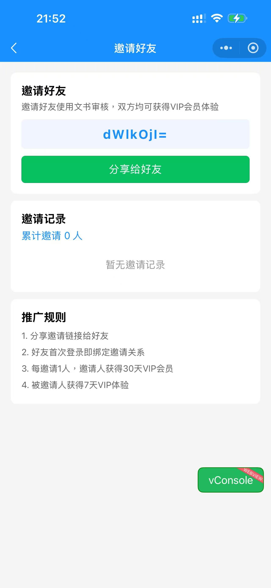
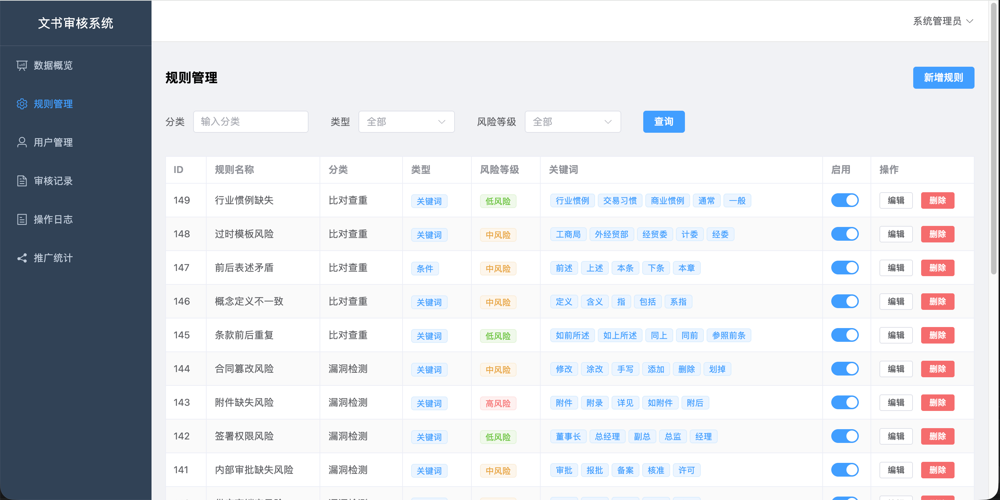
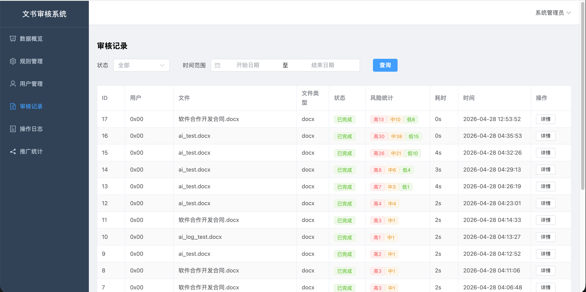
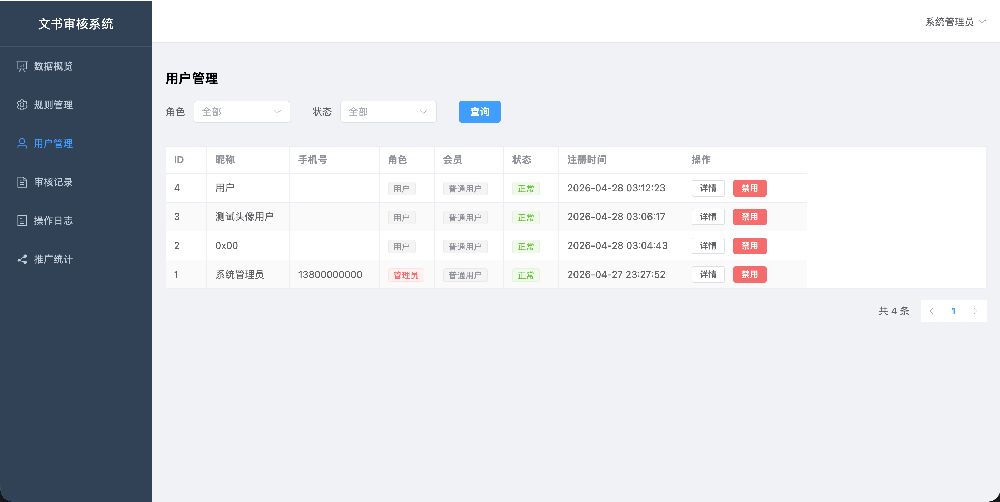

# 智审文书 — 小程序 & App

专业文书合同智能审核系统，支持微信小程序和 Android/iOS 原生 App。

## 功能概述

- **文件上传**：支持 DOCX / PDF 格式
- **智能审核**：内置规则库 + AI 双重审核
- **风险检测**：覆盖违约条款、隐私合规、知识产权等10+维度
- **审核报告**：自动生成结构化风险报告

## 界面截图

### 首页



### 审核结果



### 历史记录



### 报告页



### 个人中心



### 会员中心



### 邀请好友



## 技术栈

| 层 | 技术 |
|------|------|
| 前端 | uni-app (Vue 3) + Pinia |
| 后端 | Node.js + Express + Sequelize |
| 数据库 | MySQL + Redis |
| 存储 | 腾讯云 COS |
| AI | DeepSeek API (可选) |

## 项目结构

```
├── miniprogram/   # 前端 (uni-app)
│   └── src/
│       ├── pages/     # 页面
│       ├── store/     # 状态管理
│       └── utils/     # 工具函数
├── server/        # 后端 (Express)
│   └── src/
│       ├── routes/    # 接口路由
│       ├── models/    # 数据模型
│       ├── services/  # 业务服务
│       └── middleware/ # 中间件
├── admin/         # 管理后台
└── database/      # 数据库脚本
```

## 运行方式

```bash
# 后端
cd server && npm install && npm run dev

# 小程序开发
cd miniprogram && npm install && npm run dev:mp-weixin

# App构建
cd miniprogram && npm run build:app-plus

# 管理后台
cd admin && npm install && npm run dev
```

## 管理后台截图

### 规则管理



### 审核记录



### 用户管理



## 管理后台登录

1. 登录页网址：`http://localhost:8080`
2. 账号：数据库中 `role='admin'` 的用户手机号
3. 密码：`admin123`

首次使用需在 MySQL 中设置管理员手机号：

```sql
UPDATE users SET phone = '13800000000' WHERE role = 'admin';
```

之后用 `13800000000` / `admin123` 登录即可。
